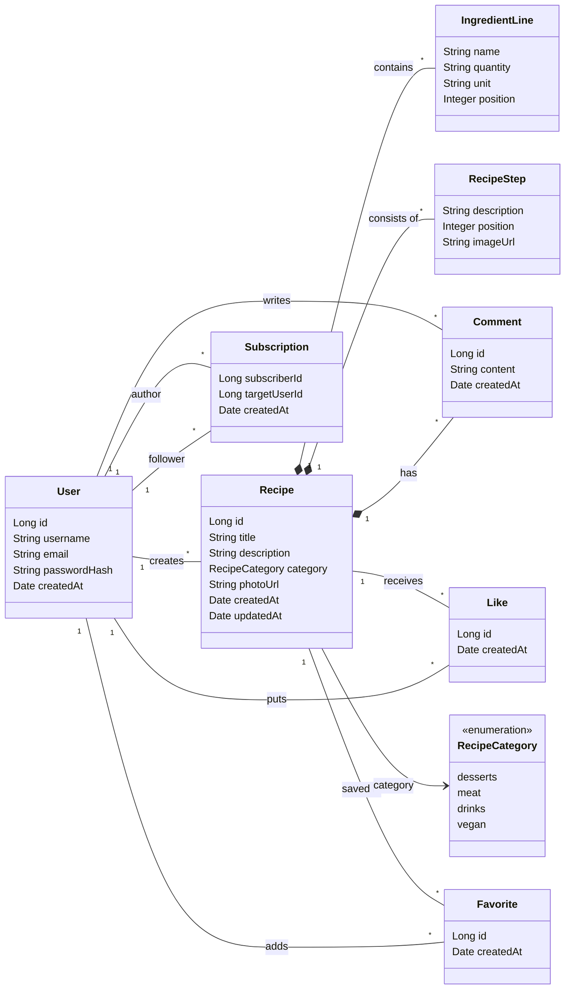

# Доменная модель системы RecipeNetwork

## 1. Предметная область

`RecipeNetwork` — это веб-приложение для публикации и просмотра рецептов с элементами социальной сети.

Пользователь системы может:

- зарегистрироваться и войти в систему;
- публиковать рецепты;
- просматривать рецепты других пользователей;
- добавлять рецепты в избранное;
- ставить лайки;
- подписываться на авторов;
- оставлять комментарии.

Таким образом, предметная область включает не только хранение рецептов, но и социальные взаимодействия между пользователями.  
Для корректного моделирования этих взаимодействий лайки, избранное и подписки представлены как отдельные сущности-связки.

---

## 2. Основные сущности доменной модели

Сущность — это объект предметной области, который имеет собственную идентичность и существует во времени.

### 2.1. User

**Пользователь системы**

**Атрибуты:**
- `id`
- `username`
- `email`
- `passwordHash`
- `createdAt`

**Назначение:**  
Представляет зарегистрированного пользователя, который может создавать рецепты, комментировать их, добавлять рецепты в избранное, ставить лайки и подписываться на других пользователей.

### 2.2. Recipe

**Рецепт**

**Атрибуты:**
- `id`
- `title`
- `description`
- `category`
- `photoUrl`
- `createdAt`
- `updatedAt`

**Назначение:**  
Представляет опубликованный рецепт, содержащий название, описание, категорию, изображение, состав, шаги приготовления и информацию об авторе.

### 2.3. Comment

**Комментарий к рецепту**

**Атрибуты:**
- `id`
- `content`
- `createdAt`

**Назначение:**  
Представляет комментарий, оставленный пользователем под конкретным рецептом.

### 2.4. Like

**Лайк рецепта**

**Атрибуты:**
- `id`
- `createdAt`

**Назначение:**  
Фиксирует факт того, что конкретный пользователь поставил лайк конкретному рецепту.

### 2.5. Favorite

**Избранное**

**Атрибуты:**
- `id`
- `createdAt`

**Назначение:**  
Фиксирует факт того, что конкретный пользователь добавил конкретный рецепт в избранное.

### 2.6. Subscription

**Подписка на автора**

**Атрибуты:**
- `subscriberId`
- `targetUserId`
- `createdAt`

**Назначение:**  
Фиксирует факт подписки одного пользователя на другого пользователя.

---

## 3. Value Objects

Value Object — это объект, который определяется не идентификатором, а своими значениями.

### 3.1. IngredientLine

**Ингредиент рецепта**

**Атрибуты:**
- `name`
- `quantity`
- `unit`
- `position`

**Назначение:**  
Описывает одну строку состава рецепта: название ингредиента, количество, единицу измерения и позицию в списке.

### 3.2. RecipeStep

**Шаг приготовления**

**Атрибуты:**
- `description`
- `position`
- `imageUrl`

**Назначение:**  
Описывает один шаг приготовления блюда, его порядок и, при необходимости, изображение шага.

### 3.3. RecipeCategory

**Категория рецепта**

**Допустимые значения:**
- `desserts`
- `meat`
- `drinks`
- `vegan`

**Назначение:**  
Используется для классификации рецептов по типу.

---

## 4. Связи между сущностями

### 4.1. User — Recipe
- Один пользователь может создать много рецептов.
- Один рецепт принадлежит одному автору.

**Тип связи:**  
`User 1 -> * Recipe`

### 4.2. Recipe — IngredientLine
- Один рецепт содержит много ингредиентов.
- Один ингредиент существует только внутри конкретного рецепта.

**Тип связи:**  
`Recipe 1 -> * IngredientLine`

### 4.3. Recipe — RecipeStep
- Один рецепт содержит много шагов приготовления.
- Один шаг существует только внутри конкретного рецепта.

**Тип связи:**  
`Recipe 1 -> * RecipeStep`

### 4.4. Recipe — Comment
- Один рецепт может иметь много комментариев.
- Один комментарий относится только к одному рецепту.

**Тип связи:**  
`Recipe 1 -> * Comment`

### 4.5. User — Comment
- Один пользователь может оставить много комментариев.
- Один комментарий принадлежит одному пользователю.

**Тип связи:**  
`User 1 -> * Comment`

### 4.6. User — Like — Recipe
- Один пользователь может поставить много лайков.
- Один лайк ставится одним пользователем.
- Один рецепт может иметь много лайков.
- Один лайк относится к одному рецепту.

**Тип связи:**  
`User 1 -> * Like`  
`Recipe 1 -> * Like`

### 4.7. User — Favorite — Recipe
- Один пользователь может добавить в избранное много рецептов.
- Одна запись избранного принадлежит одному пользователю.
- Один рецепт может находиться в избранном у многих пользователей.
- Одна запись избранного относится к одному рецепту.

**Тип связи:**  
`User 1 -> * Favorite`  
`Recipe 1 -> * Favorite`

### 4.8. User — Subscription — User
- Один пользователь может подписаться на многих авторов.
- Одна подписка создаётся одним подписчиком.
- Один пользователь может иметь много подписчиков.
- Одна подписка указывает на одного автора.

**Тип связи:**  
`User 1 -> * Subscription` (как подписчик)  
`User 1 -> * Subscription` (как автор)

---

## 5. Инварианты доменной модели

Инварианты — это правила, которые всегда должны соблюдаться.

### Для User
- имя пользователя обязательно;
- имя пользователя должно быть уникальным;
- email должен быть уникальным;
- пароль в системе должен храниться только в виде хеша;
- пользователь не может подписаться сам на себя.

### Для Recipe
- рецепт не может существовать без названия;
- рецепт не может существовать без автора;
- рецепт должен содержать хотя бы один ингредиент;
- рецепт должен содержать хотя бы один шаг приготовления;
- категория рецепта должна принадлежать допустимому набору значений.

### Для Comment
- комментарий не может быть пустым;
- комментарий должен быть привязан к существующему рецепту;
- комментарий должен быть привязан к существующему пользователю.

### Для Like
- один пользователь не может поставить лайк одному и тому же рецепту дважды;
- лайк может быть поставлен только существующему рецепту существующим пользователем.

### Для Favorite
- один пользователь не может добавить один и тот же рецепт в избранное дважды;
- запись избранного может существовать только для существующего рецепта и существующего пользователя.

### Для Subscription
- одна и та же подписка не может быть создана дважды;
- пользователь не может подписаться сам на себя;
- подписка может существовать только между существующими пользователями.

---

## 6. Агрегаты

### 6.1. Aggregate `Recipe`
Корень агрегата — `Recipe`.

Внутри агрегата:
- `IngredientLine`
- `RecipeStep`
- `Comment`

Причина: все эти объекты существуют в контексте конкретного рецепта и определяют его содержимое и обсуждение.

### 6.2. Aggregate `User`
Корень агрегата — `User`.

Причина: пользователь является самостоятельной сущностью с собственной идентичностью и жизненным циклом.

### 6.3. Aggregates `Like`, `Favorite`, `Subscription`
Корни агрегатов:
- `Like`
- `Favorite`
- `Subscription`

Причина: это отдельные сущности-связки, которые фиксируют социальные действия пользователей, имеют собственный жизненный цикл и собственные инварианты уникальности.

---

## 7. Границы доменной модели

В рамках данной доменной модели рассматривается один контекст:  
**социальная платформа рецептов**.

В модель **не входят**:
- детали HTTP API;
- детали реализации базы данных;
- пользовательский интерфейс;
- маршруты frontend;
- технические настройки сервера.

То есть доменная модель описывает **не то, как система выглядит**, а **то, какие объекты и правила существуют в предметной области**.

---

## 8. UML-представление доменной модели

### Сущности и value objects

